# 系统架构与流程图

## 一、系统整体架构

```mermaid
graph TB
    subgraph "前端层 Frontend"
        A1[Vue 3 应用]
        A2[Element Plus UI]
        A3[Axios HTTP客户端]
        A1 --> A2
        A1 --> A3
    end

    subgraph "后端层 Backend"
        B1[Spring Boot应用]
        B2[Controller层<br/>REST API]
        B3[Service层<br/>业务逻辑]
        B4[DAO层<br/>MyBatis Mapper]
        B5[Excel导出服务<br/>Apache POI]

        B1 --> B2
        B2 --> B3
        B3 --> B4
        B3 --> B5
    end

    subgraph "数据层 Database"
        C1[(MySQL 8.0)]
        C2[classification_record<br/>分类记录表]
        C3[test_case<br/>用例表]
        C4[scenario<br/>场景表]
        C5[vertical_category<br/>垂类表]
        C6[factor<br/>因子表]
        C7[factor_value<br/>因子值表]

        C1 --> C2
        C1 --> C3
        C1 --> C4
        C1 --> C5
        C1 --> C6
        C1 --> C7
    end

    A3 -->|HTTP/JSON| B2
    B4 --> C1
    B5 -.->|生成Excel文件| A3

    style A1 fill:#409EFF,color:#fff
    style B1 fill:#67C23A,color:#fff
    style C1 fill:#E6A23C,color:#fff
```

---

## 二、数据流转流程

### 2.1 查询混淆矩阵流程

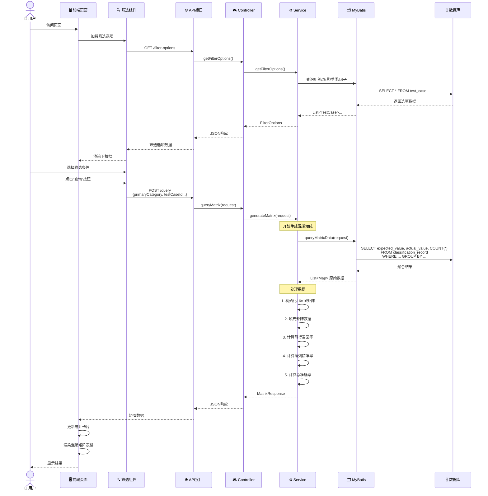

---

### 2.2 单元格详情查询流程

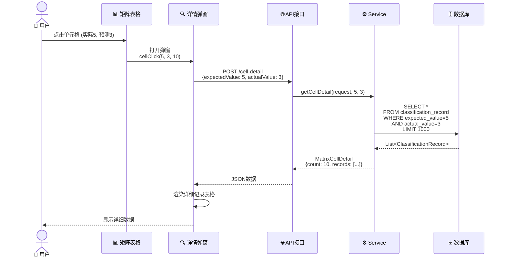

---

### 2.3 Excel导出流程

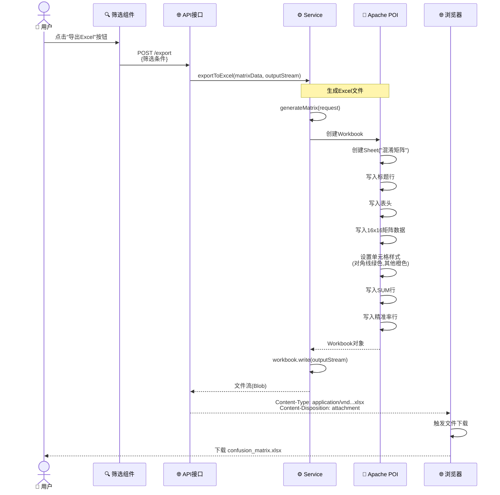

---

## 三、前端组件架构

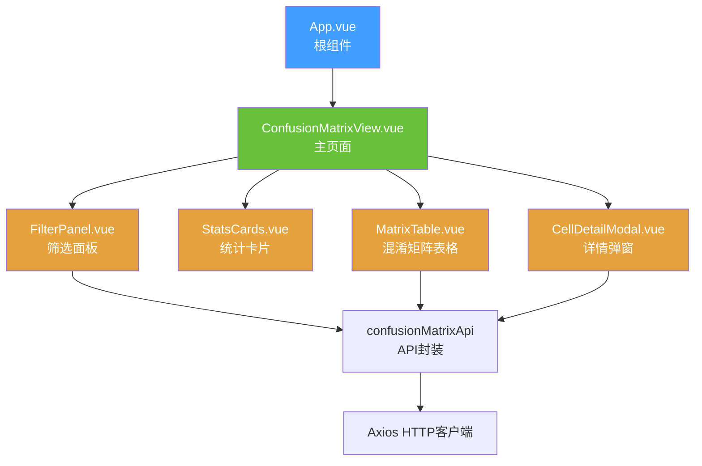

---

## 四、后端分层架构

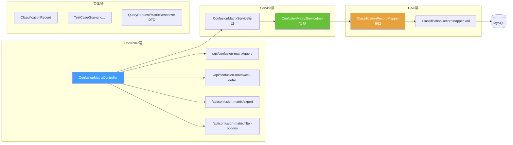

---

## 五、数据库ER图

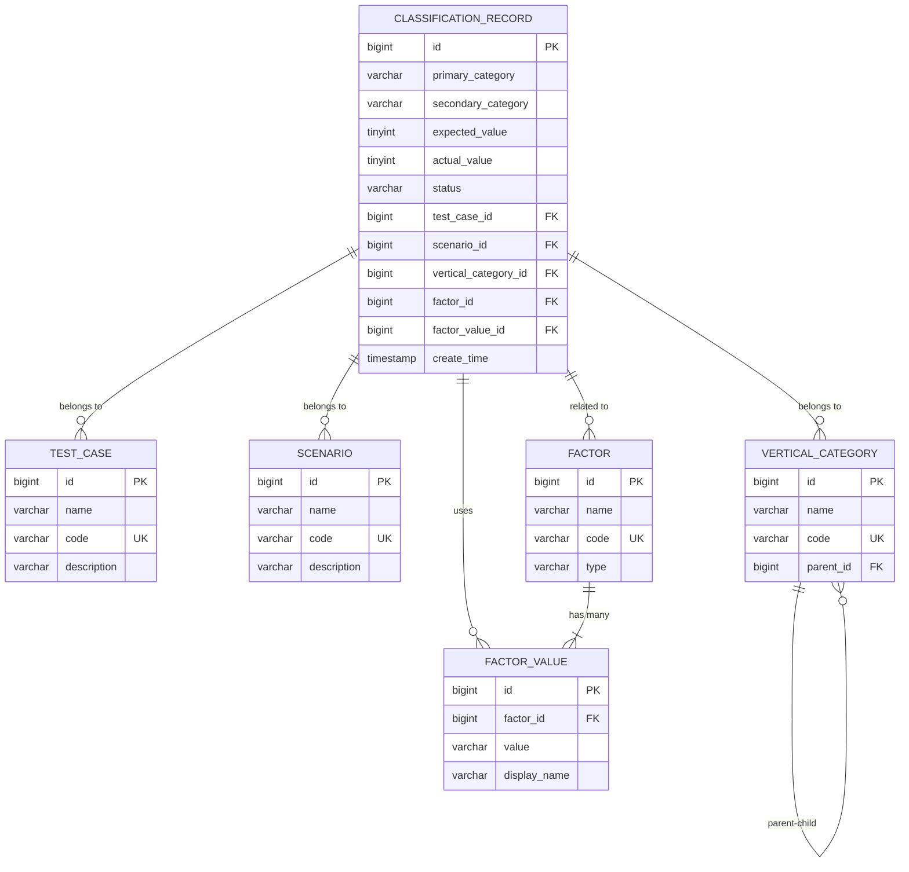

---

## 六、混淆矩阵计算逻辑

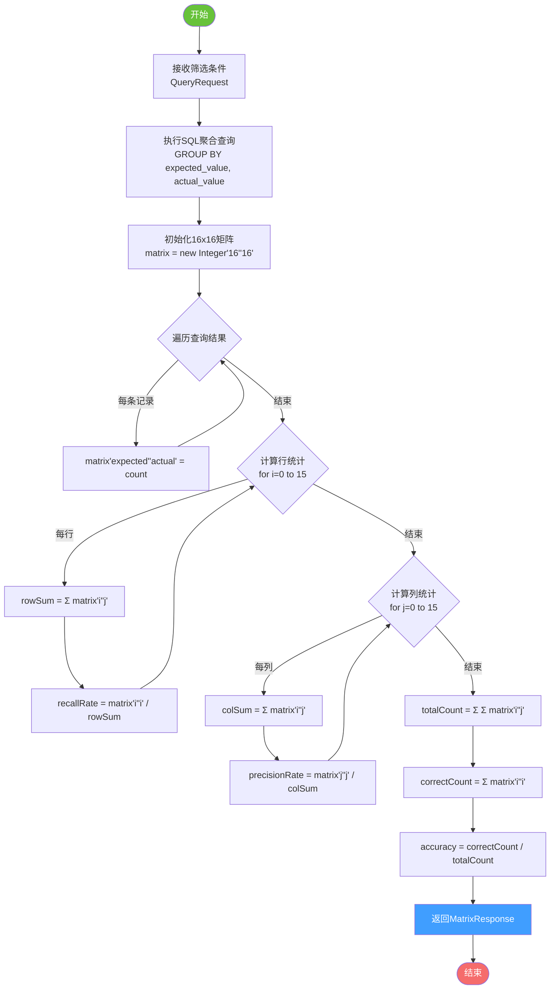

---

## 七、召回率与精准率计算公式

### 7.1 召回率 (Recall) - 行统计

对于实际标签 `i`:

```
召回率(i) = 正确预测数 / 实际总数
         = matrix[i][i] / Σ(matrix[i][j]), j=0..15
```

**示例**:
- 实际为5的样本有100个
- 其中80个被正确预测为5
- 召回率 = 80 / 100 = 80%

### 7.2 精准率 (Precision) - 列统计

对于预测标签 `j`:

```
精准率(j) = 正确预测数 / 预测总数
         = matrix[j][j] / Σ(matrix[i][j]), i=0..15
```

**示例**:
- 预测为5的样本有120个
- 其中80个实际确实是5
- 精准率 = 80 / 120 = 66.7%

### 7.3 总准确率 (Accuracy)

```
总准确率 = 所有正确预测数 / 总样本数
        = Σ(matrix[i][i]) / Σ Σ(matrix[i][j])
```

---

## 八、混淆矩阵可视化示例

```
一级分类: 服装  |  二级分类: 上衣

              预测0  预测1  预测2  ...  预测15  │ SUM   召回率
          ────────────────────────────────────┼─────────────
实际0        45      3      1    ...    0     │  50    90%   ✅
实际1         2     38      0    ...    0     │  40    95%   ✅
实际2         1      0     35    ...    0     │  38    92%   ✅
...         ...    ...    ...    ...   ...    │ ...    ...
实际15        0      0      1    ...   28     │  30    93%   ✅
          ────────────────────────────────────┼─────────────
SUM          52     45     42    ...   30     │ 500
精准率       86%    84%    83%   ...   93%    │ 总准确率: 92%
            ✅     ✅     ✅          ✅
```

**颜色编码**:
- 🟢 **对角线** (实际=预测): 绿色背景 - 预测正确
- 🟠 **非对角线**: 橙色背景 - 预测错误
- ⚪ **0值**: 灰色背景 - 无数据

---

## 九、系统部署架构

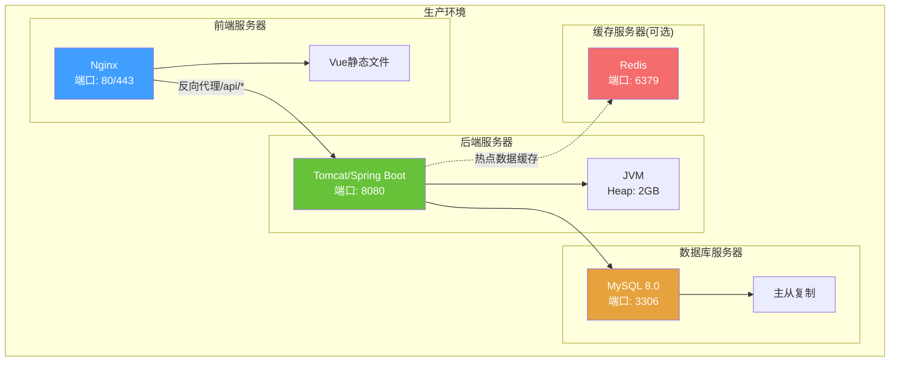

---

## 十、性能优化策略

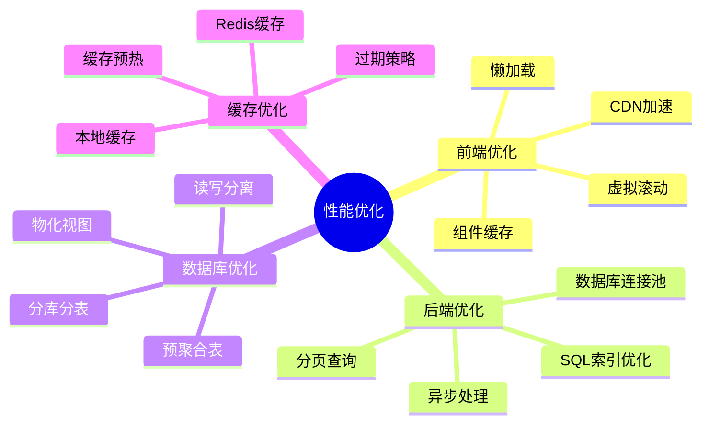

---

## 十一、开发与部署流程

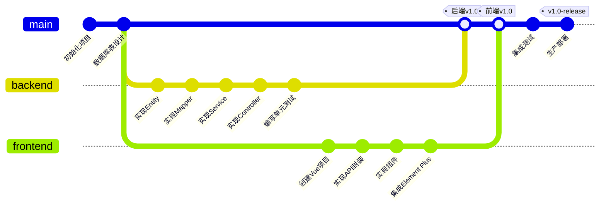

---

**总结**: 本系统是一个典型的**前后端分离架构**,采用**Vue 3 + Spring Boot + MySQL**技术栈,核心功能是通过**混淆矩阵**可视化分类模型的预测效果,并提供灵活的多维度筛选和Excel导出功能。
